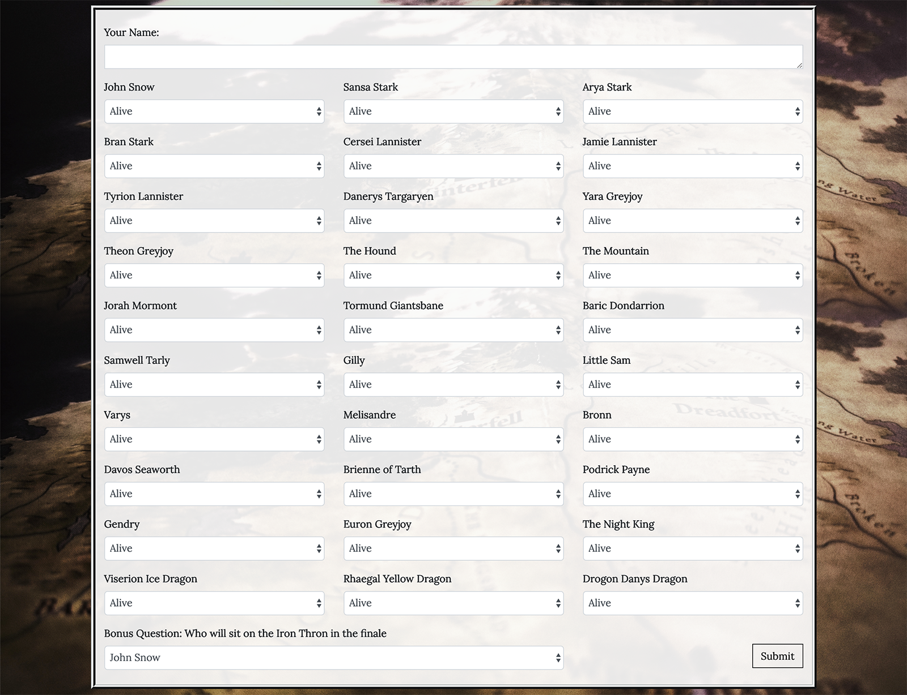
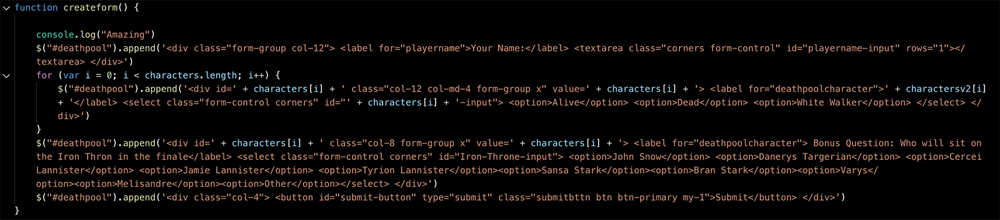
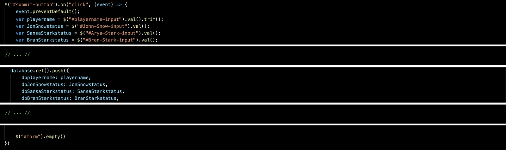
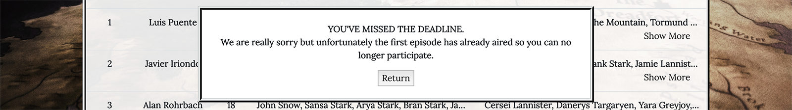
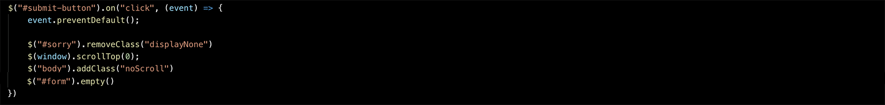
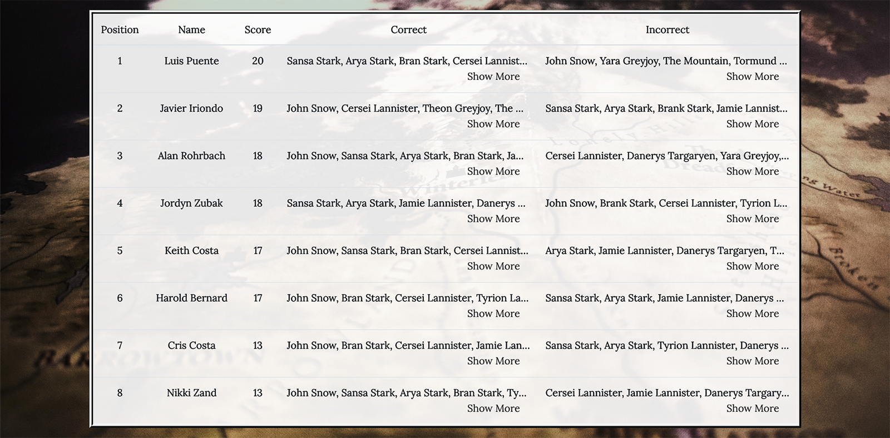
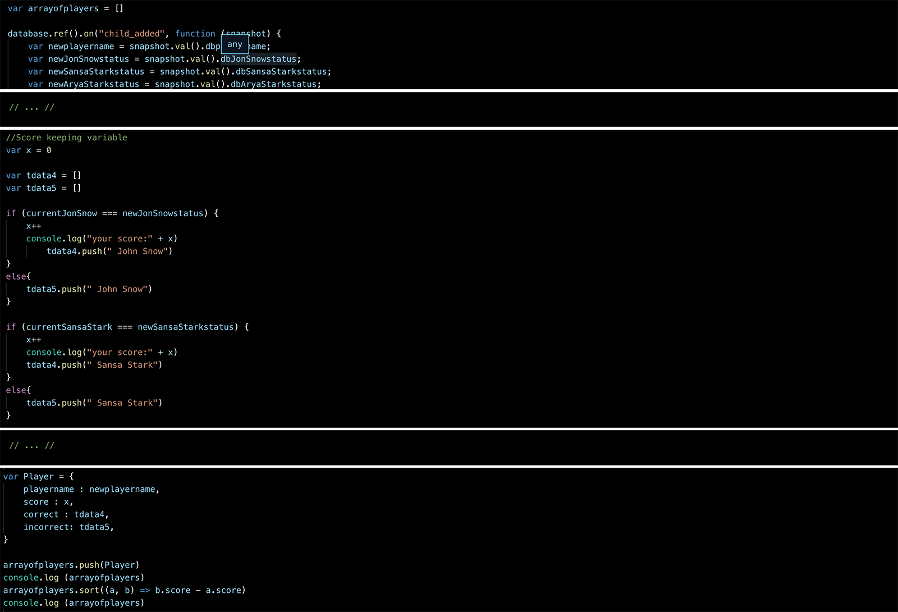
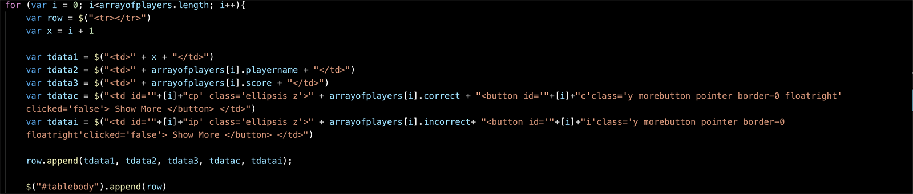
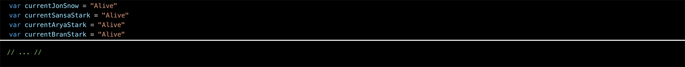

# GOTDeathPool
https://klcosta.github.io/GOTDeathPool/

The Game of Thrones Season 8 Deathpool was a friendly online game with family and friends. Before the first episode of the final season of Game of Thrones we predicted the fate of all characters. After each episode aired the site was updated. This project used HTML, CSS, Bootstrap and Firebase.

## Before the First Episode

All players were required to fill out the following form before the first episode aired. The answers were stored and saved in a Firebase database. 

The form is dinamically created using the JavaScript file. The first and final question of the form are different than the rest so they are created seperately. A foorloop deals with all other questions. Finally the submit button is appended to the form. The form uses the .append() method for all questions. 

A click funtion is connected to the submit button. Up clicking on the button variables are created for the player's name and his responses. These are then stored in the firebase database. The form is the dinamically removed from the site. 

## After the First Episode

### Submit Button 

After the first episode aired the on click function associated eith the submit button was changed to alert the player that he can no longer join the game. 

I accomplished this by changing the code manually. I remove the displayNone class from the modal, scrolled the site back up to the top using the .scrollTop() attribute and lock the screen using CSS (overflow: hidden on the body)

### Leader Board

When loading the site the browser dinamically creates the leaderboard. All of the data is pulled down from the Firebase Database. Then the users choices are compared to the current status of each character. A score is assigned to each user. The leaderboard is sorted using each users score. Then it is displayed.

I used an empty array called arrayofplayers to store all of the different users and all the necessary information. The data is pulled from the database and assigned a set of new variables. The function then compares the users information with that the current status of character using a series of if else statements. If the statuses match the score is added to by one. The if esle statements are also used to put the users response in the correct or incorrect table cells. This data is stored in a object and pushed to the empty array. Then I used the .sort() methodology to sort the array. 

Once this process is finished the information is displayed on the screen. I use a a forloop to run through the arrayofplayers. I dinamically create a new row with each players data. I then use .append to add that row to the table creating a leaderboard. 

## After Each Episode

The current status of each character is stored in variables. After each episode I changed them and pushed the changes. The leaderboard would be automatically changed. 

